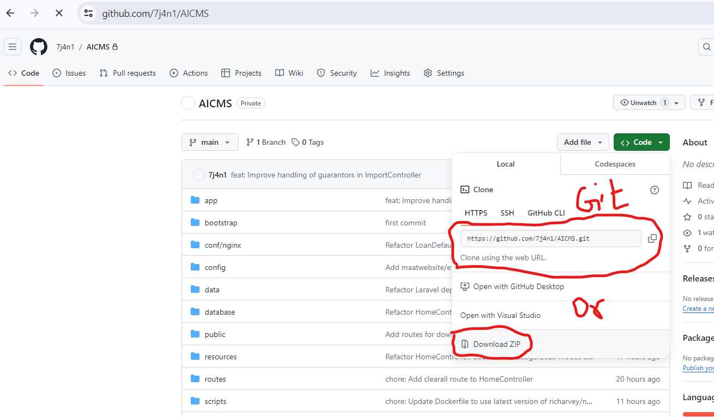
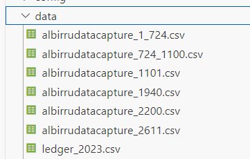
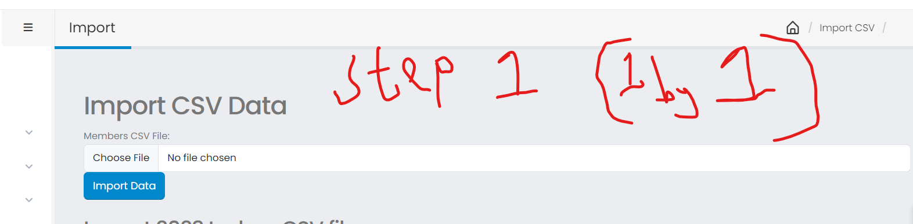
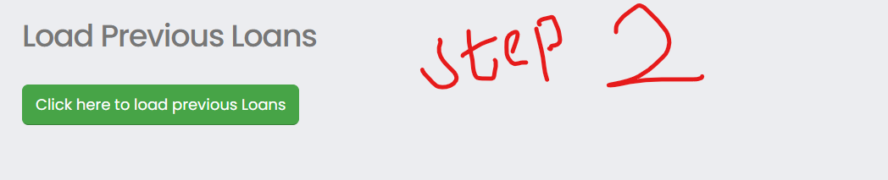
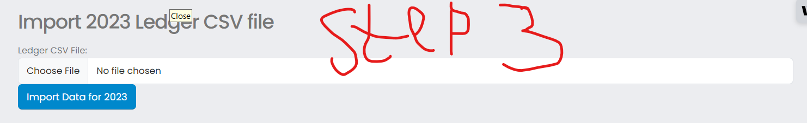

# AlBirr MCS Documentation


## Table of Contents

- [Getting Started](#getting-started)
  - [Prerequisites](#prerequisites)
  - [Installation](#installation)


## Getting Started

### Prerequisites

Before you start, make sure you have the following prerequisites installed on your system:

- PHP (>= 7.4) or Xampp
- PHP Composer (You can download from getcomposer.org)
- Database (e.g., MySQL)
- Git cli (optional)

### Installation

1. Clone this repository or download zip:


   ```bash
   git clone https://github.com/7j4n1/AICMS.git
   cd AICMS 
   ```
2. cd into your project, You will need to be inside that project file to enter all of the rest of the commands in this readme. So remember to type 
```bash
cd AICMS
```
 to move your terminal working location to the project file we just barely created.

2. Install PHP dependencies using Composer:
Whenever you clone a new Laravel project you must now install all of the project dependencies. This is what actually installs Laravel itself, among other necessary packages to get started.

    ```bash
    composer install 
    ```
    or try
    ```bash
    composer update
    ```
3. Create a copy of your .env file. We will make a copy of the .env.example file and create a .env file that we can start to fill out to do things like database configuration in the next few steps.

    ```bash
    cp .env.example .env
    ```
    or 

    ```bash
    scp .env.example .env
    ```
    This will create a copy of the .env.example file in your project and name the copy simply .env.
    
4. Generate an app encryption key
Laravel requires you to have an app encryption key which is generally randomly generated and stored in your .env file. The app will use this encryption key to encode various elements of your application from cookies to password hashes and more.
In the terminal we can run this command to generate that key. (Make sure that you have already installed Laravel via composer and created an .env file before doing this, of which we have done both).
    ```bash
    php artisan key:generate
    ```
    If you check the .env file again, you will see that it now has a long random string of characters in the APP_KEY field. We now have a valid app encryption key.

5. Create an empty database for our application
Create an empty database for your project using the Xampp or Mysql Application (PhpMyAdmin). In our example we created a database called “albirricms_2024”. Just create an empty database here, the exact steps will depend on your system setup.

6. In the .env file, add database information to allow Laravel to connect to the database
    Configure the database config variables as follows:
    ```
    DB_CONNECTION=mysql
    DB_HOST=127.0.0.1
    DB_PORT=3306
    DB_DATABASE=albirricms_2024
    DB_USERNAME=root
    DB_PASSWORD=
    ```
    In the .env file fill in the DB_HOST, DB_PORT, DB_DATABASE, DB_USERNAME, and DB_PASSWORD options to match the credentials of the database you just created. This will allow us to run migrations and seed the database in the next step.

7. Run the migrations after each other:
    ```bash
    php artisan optimize:clear
    
    php artisan migrate --seeder="RoleAndPermissionSeeder" --force

    php artisan migrate --seed  --force
    ```

    if they're successful, you will see the tables in the database you created (phpmyadmin)

8. Start the development server:
    ```bash
    php artisan serve

    ```
    Laravel API is now up and running on {http://localhost:8000} which is the base url!

The username and password for superadmin are the same.

## Import Member details and Ledgers

- it is very important to import the members before the ledger in order to avoid database relationship problem.
- The csv files can be found in the folder ("AICMS\data") in the project folder

1. navigate to this link, after signing in
```bash
http://localhost:8000/admin/import/members
```

the members details files(6) one after the other, they can be found in (\AICMS\data\albirrudatacapture_ files). Import successful will be returned before uploading the next one.


2. Import the Previous Loan records, by clicking on the green button. It will open a new tab, when it's done, A text will show saying "Imported, Successfully."


3. Import the Previous Ledger by selecting ledger_2003.csv

